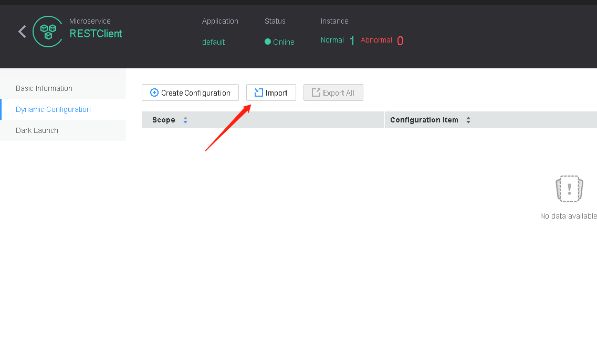
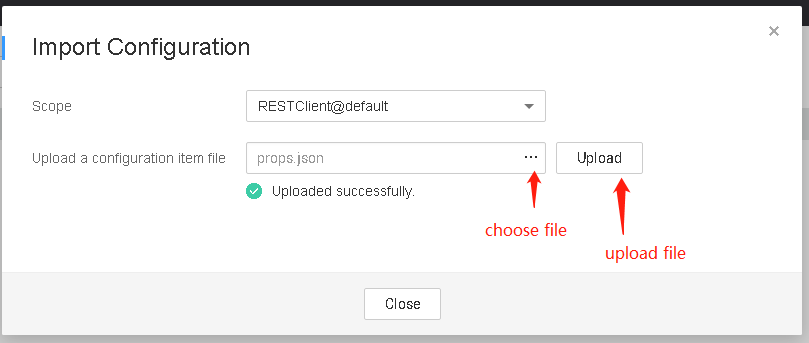
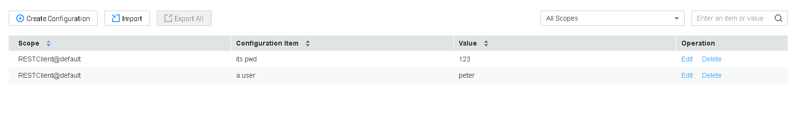
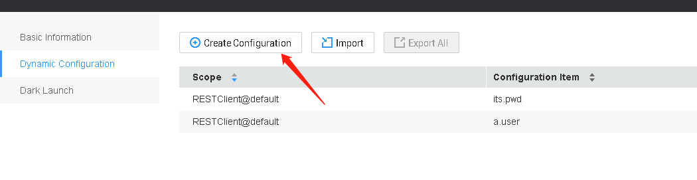
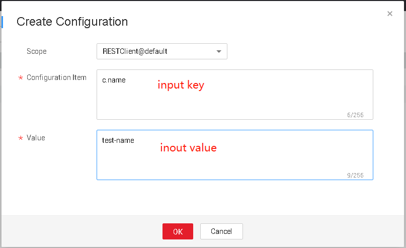
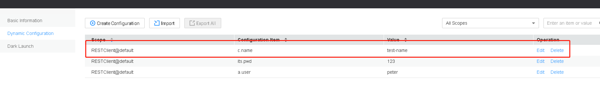

This demo show how to mange your custom configurations for archaius

archaius support json file and key: value to mange you custom . Notice here you customized
keys are not GO-Chassis governance

## json file
 JSON file:  batch mange you custom configurations

```json
{
    "a.user":"peter",
    "its.pwd":"123"
}
```

## key:value
use key:value  one-by-one mange you custom configurations
```text
"a.user":"peter"
```
## Archaius

how to use archaius for huawei cloud

### json

* Click the button `Import`


* choose json file and then click the button `Upload` to upload file


* uploaded json file successfully , you can see config

* call the api `/props/its.pwd` will reply `123`

### key:value

* Click the button `Create Configuration`


* input `key` any `value`


* set config successfully , you can see this


* call api `/props/c.name` success will reply `test-name`