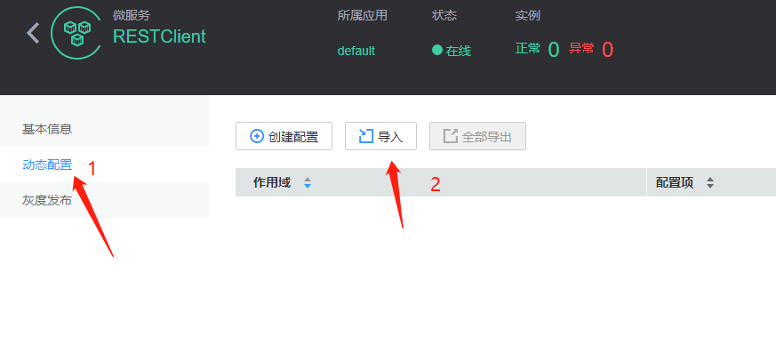
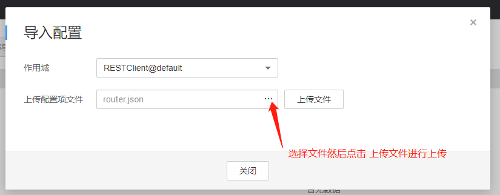

### 该demo将通过archaius管理，实现对应用配置的动态管理。

我们通过 archaius 对配置进行管理，实现动态配置的管理。以下将通过简单介绍4个场景，以及动态配置的实例。

使用动态配置，我们需要在chassis.yaml的配置中，加上配置中心的配置，如下 :
```yaml
cse:
  config:
    client:
      serverUri: https://cse.cn-north-1.myhuaweicloud.com #uri of config center
```
**注意：如果需要使用动态配置需要在配置文件中配置config center，以及在动态配置指令下发时，暂不支持自定义的key值治理配置**

### 访问规则

##### 参数
d :本次请求访问的时长，e.g.: 30s,1ms 

c :本次请求开启的goroutine数
 
delay : 每一次向provider请求sleep时间，e.g. : 10

访问示例

`http://127.0.0.1:8080/client/router?d=1s&c=1&delay=2`

#### 1 熔断
场景：服务间由服务内部接口的调用转换到外部通过网络进行通信时，发生请求错误是不可避免的，过多的错误访问严重影响服务正常使用，
达不到很好的服务保护效果。此时我们需要对服务进行熔断隔离，熔断可以很好的对上游服务进行隔离，达到对服务自身的保护。
[相关配置](https://docs.go-chassis.com/user-guides/cb-and-fallback.html#)

##### 熔断动态配置  
通过json文件对服务进行下发配置，保持和在服务动态配置界面进行导入，示例请参考cse目录下的circuit.json

```json
{
	"cse.isolation.Consumer.timeoutInMilliseconds":"1",
	"cse.isolation.Consumer.maxConcurrentRequests":"1000",
	"cse.circuitBreaker.Consumer.enabled":"true",
	"cse.circuitBreaker.Consumer.forceOpen": "false",
	"cse.circuitBreaker.Consumer.forceClosed":"false",
	"cse.circuitBreaker.Consumer.sleepWindowInMilliseconds": "10000",
	"cse.circuitBreaker.Consumer.requestVolumeThreshold":"10",
	"cse.circuitBreaker.Consumer.errorThresholdPercentage":"30"
}
```
 
上述配置，超时机制为1ms，只要耗时超过1ms的请求都是将访问超时，此处超时是为了服务产生熔断的效果。
在请求数达到10并且错误请求超过30%时，将开启熔断。服务将在sleep 10000ms后恢复正常访问


#### 2 负载均衡

场景：在我们同一个版本存在多个实例时，我们此时只想访问一个实例，而不想同时访问多个实力，我们可以配置会话保持策略。
如果我们需要根据请求实例的响应时间的长短进行选择实例时，我们可以配置WeightedResponse。[更多配置](https://docs.go-chassis.com/user-guides/strategy.html)


##### 负载均衡动态配置  
配置参考load_balancing.json
```json
{
	"cse.loadbalance.RESTServer.strategy.name":"SessionStickiness"
} 
```

#### 3 容错
场景：将服务拆分成若干个微服务后，服务之间将通过网络进行互相通信，但是网络通信并非可靠的，随时都可能存在不能访问的时候，
此时我们就需要对访问失败的服务进行合理的重试，适当降低网络造成的影响
[相关配置](https://docs.go-chassis.com/user-guides/fault-tolerance.html)

##### 容错动态配置 

配置参考fault.json
```json
{
	"cse.loadbalance.retryEnabled":"true",
	"cse.loadbalance.retryOnNext":"10",
	"cse.loadbalance.retryOnSame":"10",
	"cse.loadbalance.backoff.kind":"jittered",
	"cse.loadbalance.backoff.MinMs":"200",
	"cse.loadbalance.backoff.MaxMs":"400"
}
```

以上熔断配置在访问实例失败后，会对同一个实例进行重试10次后获取下一个实例。重试获取下一个只会进行十次。


#### 4 灰度发布

场景:当我们在版本需要灰度升级时，我们可以通过自定义的规则将请求分配到不同的服务。部分求情分配到新的服务，此时不仅
可以对新版本的服务进行验证有可以保证服务正常服务。[更多配置](https://docs.go-chassis.com/user-guides/router.html)


##### 路由动态配置

* 点击服务界面的灰度发布，然后点击添加配置


* 在配置界面中可以选择权重进行分配，也可以自定义规则


* 成功配置后，如下图


* 本地配置请参考router.yaml
动态配置演示：

* 点击服务进入服务详细，先点击动态配置，后点击导入




* 选择编写好的配置文件。并点击上传，上传配置文件


* 成功上传配置后可以看到如下界面

